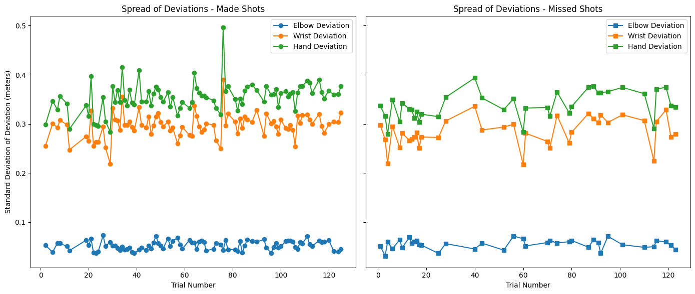
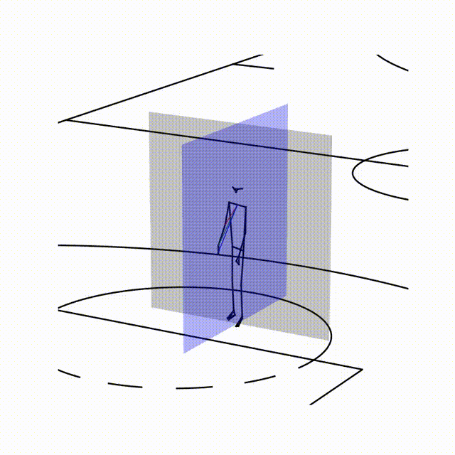

## Free Throw Biomechanics Analysis

This project analyzes the biomechanics of free throw shooting using motion capture data from the SPL Open Data repository. The analysis focuses on how elbow, wrist, and hand deviations impact free throw performance across trials, emphasizing the importance of consistency and proper alignment in successful shots.

---

### Table of Contents

- [Introduction](#introduction)
- [Data Source](#data-source)
- [Analysis Summary](#analysis-summary)
- [Results](#results)
- [Further Exploration](#further-exploration)
- [Acknowledgments](#acknowledgments)

---

## Introduction

The biomechanics of a free throw are critical to basketball performance. By analyzing motion capture data, we can gain insights into how different body movements and positions affect shooting accuracy. This project aims to assess shoulder alignment and posture by examining deviations in the elbow, wrist, and hand during free throw attempts.

## Data Source

The data used in this project is sourced from the [SPL Open Data repository](https://github.com/mlsedigital/SPL-Open-Data). This repository is a collection of biomechanics datasets collected by Maple Leaf Sports & Entertainment's (MLSE) Sport Performance Lab (SPL) in Toronto, Ontario, Canada.

**SPL Open Data Repository:**

- Provides raw markerless motion capture data typically used by sports biomechanists.
- Aims to improve data equity and analytical biomechanical skills in the community.
- Open-sourced to allow public access and encourage research and education in sports biomechanics.

## Analysis Summary

As part of the SPL data competition, our group focused on understanding the impact of limb deviations on free throw performance. My role was too examine:

- **Midpoint and Deviations**: Assessed shoulder alignment and posture by calculating the midpoint between shoulders and measuring deviations of the elbow, wrist, and hand from this midpoint.
- **Consistency During the Shot**: Analyzed how variations in limb positions affected the outcome of free throw attempts across multiple trials.
- **Trends Over Trials**: Observed dynamics that could point to effects of fatigue, learning, or adjustments in technique.

**Key Findings:**

- **Elbow Deviation**: The average elbow distance was greater for missed shots, suggesting that overextension or excessive deviation of the elbow negatively impacts accuracy.
- **Wrist and Hand Deviation**: The opposite trend was observed for the wrist and hand. As the elbow extends away from the body, the wrist and hand move closer to it, affecting the shot (similar to the shooting form of players like Kevin Durant).
- **Importance of Alignment**: Stable and less extended elbows, combined with better wrist and hand extension, contribute to successful shots. This emphasizes that consistency and proper alignment are key to better free throw performance.

  

 Spread of Deviation for Made and Missed shots </figcaption> 

## Results

- **Elbow Deviation**: Excessive elbow deviation correlates with a higher likelihood of missing the shot.
- **Wrist and Hand Deviation**: Proper extension and alignment of the wrist and hand contribute positively to shot accuracy.
- **Importance of Alignment**: Observations suggest that shooters may adjust their technique over trials, impacting consistency and performance.

## Further Exploration

- Open the jupter notebook [(deviation.ipynb)](./basketball/freethrow/deviation.ipynb) to see the full analysis.

## Acknowledgments

- **Maple Leaf Sports & Entertainment's Sport Performance Lab (SPL)**: For providing the open-source biomechanics data.
- SPL Open Data Repository: [Github Repo](https://github.com/mlsedigital/SPL-Open-Data)
